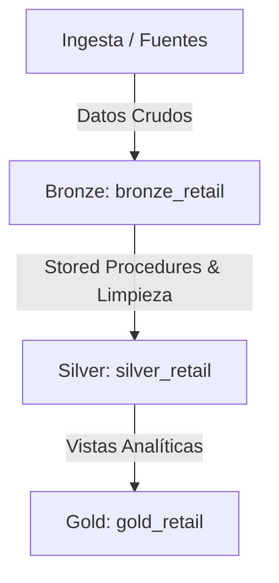
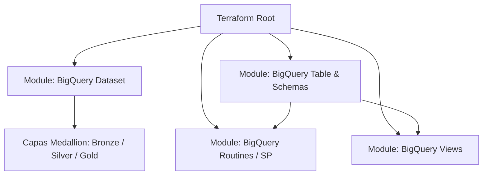

# 🚀 Modern Data Platform en GCP con Medallion Architecture y Terraform

Repositorio de Infraestructura como Código (IaC) enfocado en la implementación automatizada de una plataforma de datos moderna en Google Cloud Platform (GCP). El proyecto implementa una **Arquitectura Medallion** en BigQuery y permite un despliegue dual: mediante **CI/CD con GitHub Actions** o de **forma local manual**.

---

## 🏗️ Diagramas de Arquitectura

El repositorio cuenta con dos perspectivas arquitectónicas clave:

### 1. Arquitectura de Datos (Medallion Architecture en BigQuery)
El flujo organiza el almacenamiento analítico y el procesamiento en capas desacopladas:
* **Capa Bronze (`bronze_retail`):** Ingesta cruda de datos transaccionales, tablas particionadas y esquemas versionados mediante JSON.
* **Capa Silver (`silver_retail`):** Limpieza, consolidación y estandarización ejecutada mediante Procedimientos Almacenados (*Stored Procedures*).
* **Capa Gold (`gold_retail`):** Modelado analítico y vistas de negocio finales para consumo.



### 2. Arquitectura de Despliegue (Componentes Terraform)
Estructura modular orientada a la reutilización y mantenimiento de los recursos en GCP:



## 📂 Estructura del Proyecto

```text
.
├── .github/
│   └── workflows/
│       └── terraform.yml            # Pipeline CI/CD de GitHub Actions
├── IAC/
│   ├── environment/
│   │   └── dev/
│   │       └── env.tfvars.json      # Configuración de variables locales
│   ├── modules/
│   │   ├── bigquery_dataset/        # Gestión de datasets por capas
│   │   ├── bigquery_routine/        # Procedimientos almacenados SQL
│   │   ├── bigquery_table/          # Creación de tablas e inyección de esquemas JSON
│   │   └── bigquery_view/           # Creación de vistas analíticas
│   ├── resources/
│   │   └── bigquery/                # Scripts SQL, schemas JSON y vistas de negocio
│   ├── main.tf                      # Orquestador principal de módulos
│   ├── provider.tf                  # Configuración del proveedor GCP
│   ├── variables.tf                 # Variables globales del sistema
│   └── outputs.tf                   # Salidas y outputs de recursos desplegados
├── LICENSE.md
└── README.md
```

## 🔐 Configuración de Secretos y Codificación Base64

Para que el pipeline de GitHub Actions pueda autenticarse de forma segura en Google Cloud sin exponer archivos de credenciales en el repositorio público, se requiere codificar la llave de la cuenta de servicio:

1. **Generar la clave en GCP:** Descarga el archivo JSON de tu Service Account desde la consola de Google Cloud y nómbralo `key.json`.
2. **Codificar en Base64 desde la terminal (Ubuntu / WSL):**
   Ejecuta el siguiente comando para transformar tu archivo JSON en una sola línea de texto codificada:
   ```bash
   base64 -w 0 key.json
   ```
3. **Configurar en GitHub Secrets:**
   * Copia el resultado del comando anterior.
   * Ve a tu repositorio en GitHub -> **Settings** -> **Secrets and variables** -> **Actions**.
   * Crea un nuevo secreto con el nombre `KEYGCP` y pega el texto codificado.

## ⚙️ Modos de Ejecución: Con CI/CD vs. Sin CI/CD (Pruebas Directas)

Este repositorio está diseñado para soportar dos modalidades operativas dependiendo de si deseas automatizar con GitHub Actions o hacer pruebas rápidas en local.

### Opción A: Con CI/CD (GitHub Actions) - Modo por Defecto
El flujo automatizado (`.github/workflows/terraform.yml`) toma las Variables de GitHub configuradas en el repositorio (`GCP_PROJECT`, `GCP_REGION`, `BUCKET_NAME`, `PROVIDER`, `ENVIRONMENT`) y genera el archivo de variables dinámicamente en el runner al vuelo:
* **Cómo funciona en el YAML:** El paso `Generate Secure tfvars file` construye el archivo `env.tfvars.json` utilizando los valores seguros provistos por GitHub Actions antes de ejecutar `terraform plan` y `terraform apply`.

### Opción B: Sin CI/CD (Pruebas directas locales)
Si por alguna razón necesitas hacer pruebas rápidas en tu máquina o debugear sin disparar GitHub Actions, debes cambiar temporalmente el archivo YAML (o usar la sección que dejamos comentada dentro del mismo archivo `terraform.yml`) para apuntar directamente a un archivo estático local.

1. Asegúrate de tener tu archivo local `IAC/environment/dev/env.tfvars.json` creado (este archivo está ignorado en el `.gitignore` por seguridad).
2. En tu archivo `.github/workflows/terraform.yml`, comenta la tarea de generación dinámica y habilita la línea del plan directo con el archivo local:
   ```yaml
   # Comenta o remueve la tarea de generación dinámica:
   # - name: Generate Secure tfvars file
   #   run: |
   #     ...
   # Y usa el comando directo apuntando al archivo local:
   - name: Terraform Init & Plan
     run: |
       terraform init
       terraform plan -var-file="environment/${{ vars.ENVIRONMENT }}/env.tfvars.json" -out=tfplan
     env:
       GOOGLE_CREDENTIALS: key.json
   ```

## 🛠️ Prerrequisitos e Instalación Local (Ubuntu / WSL)

### 1. Instalar Terraform
```bash
sudo apt-get update && sudo apt-get install -y gnupg software-properties-common
wget -O- https://apt.releases.hashicorp.com/gpg | gpg --dearmor | sudo tee /usr/share/keyrings/hashicorp-archive-keyring.gpg > /dev/null
echo "deb [signed-by=/usr/share/keyrings/hashicorp-archive-keyring.gpg] https://apt.releases.hashicorp.com $(lsb_release -cs) main" | sudo tee /etc/apt/sources.list.d/hashicorp.list
sudo apt-get update && sudo apt-get install terraform=1.9.5
```

### 2. Autenticación Local en GCP
```bash
gcloud auth login
gcloud auth application-default login
```

### 3. Despliegue Manual Local
```bash
cd IAC
terraform init
terraform plan -var-file="environment/dev/env.tfvars.json"
terraform apply -var-file="environment/dev/env.tfvars.json"
```

---